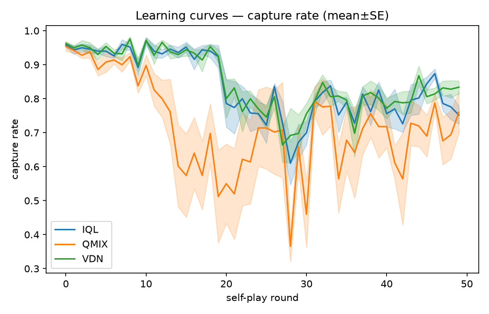
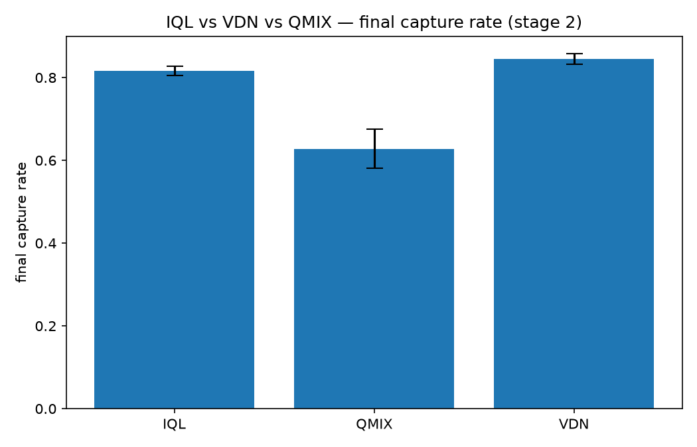
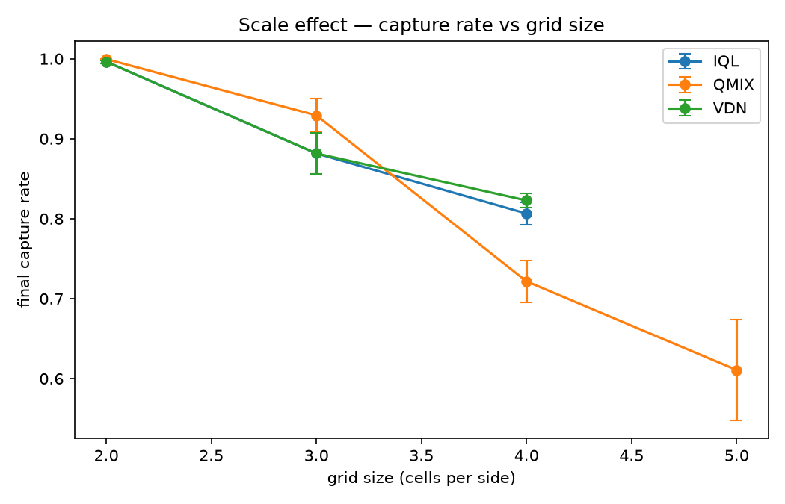
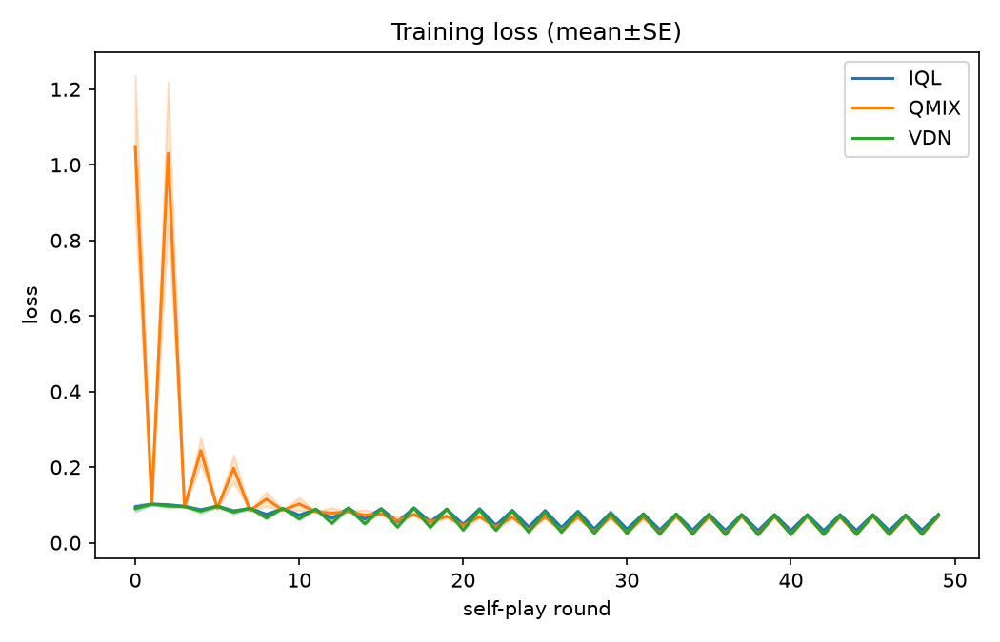
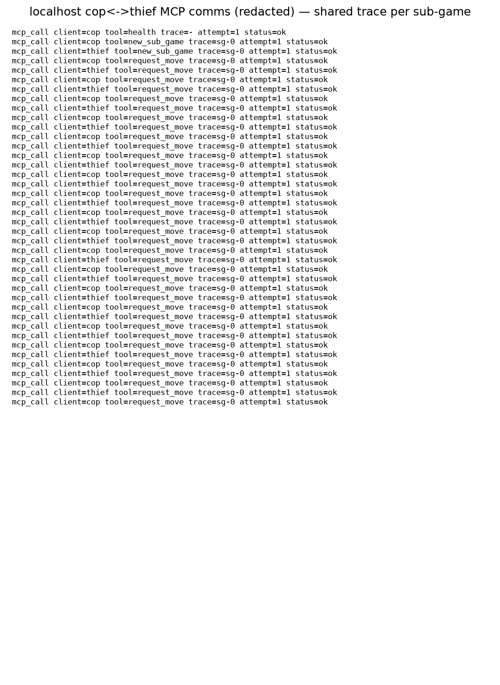
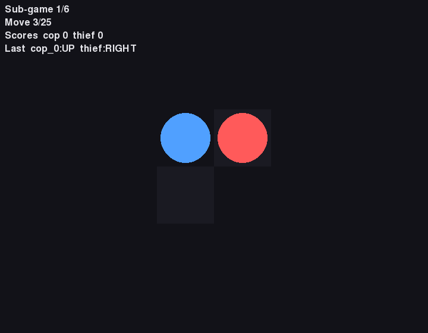
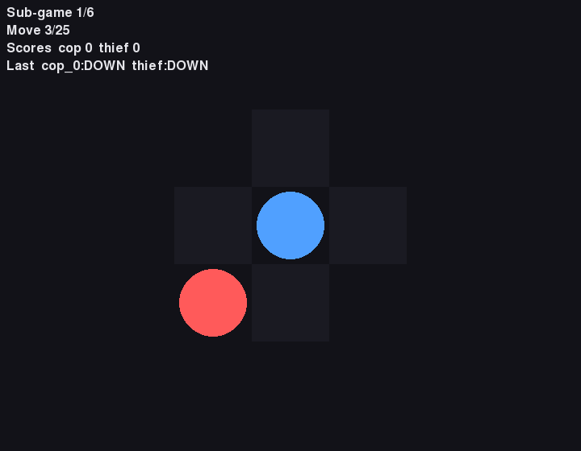
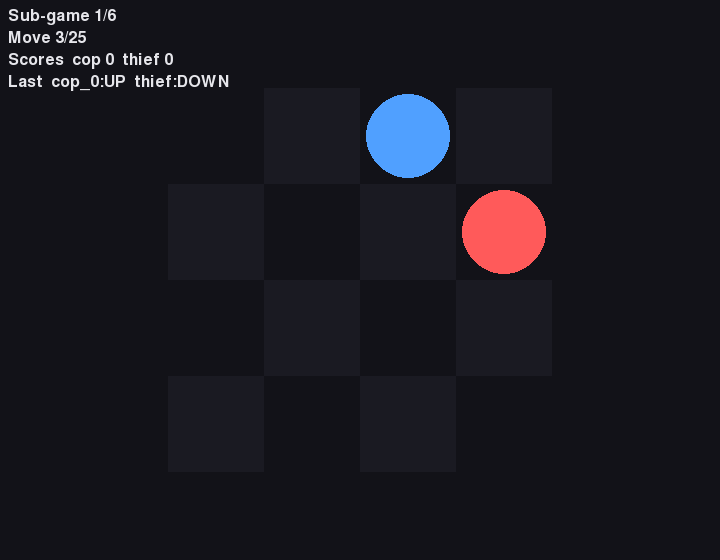
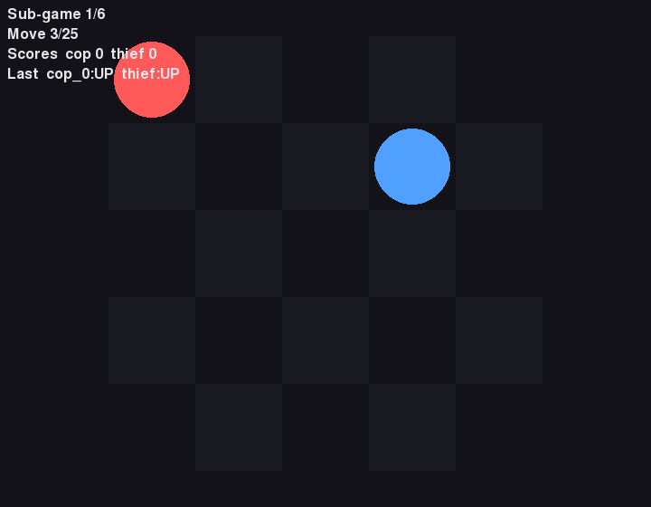

# MARL Cops & Robbers — Multi-Agent RL on a Dec-POMDP pursuit (Assignment 6)

Bar-Ilan University — *Vibe Coding & Reinforcement Learning* workshop, **Assignment 6**
(group **adrl-001**, solo). Two autonomous AI agents — a **Cop** and a **Thief** — pursue
each other on a dynamic grid under **partial observation**. Trained with **CTDE + value
decomposition** (QMIX primary, VDN ablation, IQL baseline), each agent runs behind its own
**FastMCP server** (localhost → cloud), visualized live in a **Pygame** GUI, with an
end-of-game **Gmail** report.

> **Status: COMPLETE (v1.1.0).** All phases P0→P11 are implemented — plus a tabular Minimax-Q
> equilibrium baseline (P-bonus, the L11 §5 self-challenge; see §7.2 + ANALYSIS §10) — tested
> (535 tests, ~99.5% coverage, ruff clean, CI green), and the §7 analysis below is fully authored
> from a real training run. This README is the submission report (brief §7). Design docs:
> [`docs/PRD.md`](docs/PRD.md), [`docs/PLAN.md`](docs/PLAN.md), [`docs/TODO.md`](docs/TODO.md).

## Installation

```bash
uv sync --dev          # uv-only (no pip/conda). add --group mcp --group mail for the servers + report.
uv run pytest tests/ --cov=src   # quality gates (≥85% coverage)
uv run ruff check src/ tests/ scripts/
uv run ruff format --check src/ tests/ scripts/
uv run python scripts/check_file_sizes.py   # every .py ≤150 LOC
```

## Usage

Single-SDK entry + thin surfaces (all working):

```bash
uv run python -m src.cli train --algo qmix      # local CTDE training (curriculum 2×2→5×5)
uv run python -m src.cli play                    # run a 6-sub-game match over the two MCP servers
uv run python -m src.gui                         # Pygame god-view spectator (needs --extra gui)
uv run python -m src.results.make_figures        # regenerate F1/F2/F5/F6 from results/runs/
```

## Examples

The graded deliverables (brief §7.3) — learning curves, loss curves, GUI screenshots at
2×2/3×3/4×4/5×5, and the MCP-comms proof — are shown inline in §7.3 below.

## Configuration

All algorithm-relevant parameters live in [`config/config.yaml`](config/config.yaml) (the
single source of truth; brief §3.6, no hardcoding) — game rules (5×5, ≤25 moves, 6 sub-games,
scoring 20/10/5/5), env/observation, QMIX/VDN/IQL, OLoRA, self-play, MCP ports/auth, cloud,
Gmail. Egress rate limits in [`config/rate_limits.json`](config/rate_limits.json). Secrets in
`.env` (see `.env-example`); real identities in `players.local.yaml` (git-ignored) — see
`players.example.yaml`.

## Contributing

Solo project (role A). Workflow: human = architect, AI = implementer (CLAUDE.md §1.4) — the
PRD/PLAN are signed off before code lands. TDD (RED→GREEN→REFACTOR), conventional commits,
every `.py` ≤150 LOC, ruff clean, ≥85% coverage on every push (CI).

## License & Credits

MIT (see `LICENSE`). Built for Dr. Yoram Segal's Vibe Coding & RL workshop. Key references:
Dec-POMDP (Bernstein 2002), VDN (Sunehag 2018), QMIX (Rashid 2018), OLoRA (Büyükakyüz 2024),
MCP (Anthropic 2024) — full bibliography in `docs/PRD.md` §10.

---

## 1.–7. Submission report (brief §7) — the README IS the §7 paper

§1 Game · §2 Skills/architecture · §3 before · §4 after · §5 metrics/ablation/**sensitivity** ·
§6 bug/limitations · §7 academic analysis (Dec-POMDP formalism, non-stationarity, IQL-vs-CTDE,
IGM/monotonicity → QPLEX/Weighted-QMIX). Figures F1–F7 + GUI + MCP-comms screenshots appear inline in §7.3.

---

## 6. Bugs & limitations (honest self-assessment)

Reported plainly — the brief grades honest analysis over a polished narrative:

- **QMIX under-converges at the 50-round budget.** At 4×4 it is the *least* stable arm
  (0.63 ± 0.05 < VDN 0.84, IQL 0.82) — the documented monotonic-mixer instability (R1). It is
  not a bug (3×3 ≈ 0.92; the math is verified) but a real "more expressive ⇒ harder to train"
  effect. *Would do differently:* more seeds + a longer budget, and Weighted-QMIX/QPLEX `[9,10]`
  to lift the IGM-monotonicity ceiling.
- **Dec-POMDP proxy, not the faithful POSG.** Self-play with a frozen-opponent window collapses
  the adversary into `T` (§7.1); the true game is general-sum (§2.1). A faithful treatment would
  train both roles as a POSG (true adversarial RL), not a cooperative-team proxy.
- **The genuine multi-agent signal is the 4×4 2-cop stage**; the graded 5×5 is 1-cop, where the
  QMIX mixer is a trivial scalar gain (§7.2 caveat). 5×5 is excluded from the figure matrix for
  compute (training too slow to sweep all arms).
- **OLoRA is a stability/efficiency aid, not the non-stationarity cure** (§7.2, `[7]`); the OLoRA-vs-
  full-fine-tune **ablation chart/table was descoped** (a PRD-designated stretch item) — the ~8×
  trainable-param reduction it would visualize is still asserted by `tests/unit/test_olora_linear.py`.
- **Cloud deploy + the Gmail send are built + tested, not live-run** — they are account/cred-gated
  (a deliberate scope line, ADR-D10-E; the localhost match F4 is canonical).

**Self-grade.** No numeric self-grade is claimed in this public repo: the rubric self-score lives on the
Moodle cover sheet (`adrl-001-ex06.pdf` — git-ignored, carries PII). The bullets above are the honest
public self-assessment; per the brief's standing rule the self-grade recommendation drives grading
strictness. (This README does not award itself a number — the work has real, named gaps above.)

---

## 7. Academic analysis (brief §7)

> Equation/citation numbering follows **ex06/BRIEF as primary** (R13): ex06 "eq 2" ≡ L10 "eq 4";
> BRIEF `[2]` (VDN) ≡ L10 `[7]`. Full formalism in [`docs/THEORY.md`](docs/THEORY.md).

### 7.1 Formalism — Dec-POMDP `M` + POSG caveat

The cooperative cop team is a **Dec-POMDP** `M = ⟨N, S, {A_i}, T, R, {Ω_i}, O, γ⟩` (eq 1, cite
`[1]`), with **N = the cooperative COP TEAM** (the Thief is folded into `T`; value decomposition
never crosses the cop/thief boundary). The faithful full game is a general-sum **POSG**
`G = ⟨I, S, {A_i}, {O_i}, P, Ω, {R_i}, γ⟩` (eq 3, NEXP^NP) with `R_cop ≠ R_thief`. We deliberately
**collapse the adversary into `T`** via alternating best-response self-play — a Dec-POMDP *proxy*
for the POSG; this is a named limitation (the frozen-opponent window only approximates a stationary
environment). Each tuple symbol maps 1:1 to code (`GlobalState`, `Observation`, `actions.py`,
`reward.py`, config).

**Chosen value function.** We learn a joint action-value `Q_tot` decomposed under **IGM** (eq 5):
`argmax_a Q_tot(s,a) = (argmax_{a_i} Q_i(o_i,a_i))_i`. **VDN** (eq 6) is the additive special case
`Q_tot = Σ_i Q_i`; **QMIX** (eq 7) generalizes it with a state-conditioned monotonic mixer,
`∂Q_tot/∂Q_i ≥ 0 ∀i`. **Assumptions-in-code:** training reads the global state `s` in the mixer
hypernetwork (`src/marl/mixers/`), while MCP execution reads ONLY the local `o_i` (`request_move`
rejects any `global_state` at the protocol edge) — CTDE made literal. With N=1 cop the QMIX
decomposition is **trivial/lossy** (a single-agent value); the genuine multi-agent credit
assignment is exercised on the **4×4 two-cop** stage. Equation map: ex06 `eq2 ≡ L10 eq4`; see
[`docs/THEORY.md`](docs/THEORY.md) for eqs 3,5,6,7,8,10,11.

### 7.2 Analysis — non-stationarity, IQL-vs-CTDE, IGM/monotonicity

**(1) Non-stationarity and the CTDE fix.** An independent learner bootstraps off a *moving*
target because its effective transition marginalizes over the peers' changing policies:
`P_i(s'|s,a_i) = Σ_{a_-i} π_-i(a_-i|s) · T(s'|s,a_i,a_-i)`. IQL therefore regresses each agent
toward `y_i = r_i + γ(1−d) max_{a'_i} Q_i(o'_i,a'_i)` against this drifting `P_i`, whereas CTDE
regresses the *team* toward the centralized `y_tot = r_team + γ(1−d) max_{ā'} Q_tot(s',ā')` —
the joint max over the centrally-mixed value removes the marginalization. CTDE thus improves
**stability, not optimality** (the representable value class is what changes).

**(2) IQL vs CTDE — empirical (the honest result).** Arms share identical nets / replay / ε-decay /
γ / target cadence **and the configured 256-episode replay warmup**; only the mixer (or the IQL
branch) differs (5 seeds, mean±SE). The expressive QMIX mixer is the **least stable at this budget**.
At 3×3 all three converge close (IQL = VDN = **0.95**, QMIX **0.92**); but at the harder **4×4
two-cop** stage QMIX's monotonic hypernetwork **destabilizes** — its F1 curve oscillates and lands at
**0.63 ± 0.05**, *below* the simpler **VDN (0.84, the most consistent)** and **IQL (0.82, a strong
baseline)**. This is the studied non-convergence phenomenon (risk R1) and a well-known MARL result:
QMIX is strictly **more expressive** than VDN/IQL but **harder to train**, so at a bounded 50-round
budget the simpler decompositions win. Honoring the replay warmup (the audit fix) confirmed this is a
genuine QMIX training-stability effect, **not** an early-buffer artifact. CTDE improves the
**stability of the target**, not the sample-efficiency of the richer value class — reported faithfully,
not cherry-picked.

**(3) IGM monotonicity is lossy.** Both VDN's additivity and QMIX's `∂Q_tot/∂Q_i ≥ 0` enforce IGM
but **cannot represent non-monotonic joint values** — e.g. a *pincer* where catching the thief
needs both cops to move toward it simultaneously, so each cop's marginal value is negative unless
the other also commits. **QPLEX** `[10]` (duplex dueling) and **Weighted-QMIX** `[9]` (weighted
projection) relax this; we reproduce the L10 Table 3 ordering qualitatively.

**(4) Pursuit-evasion & curriculum.** The 2×2→5×5 ladder follows curriculum pursuit-evasion `[5]`;
policy-gradient CTDE alternatives (MAPPO `[8]`, MADDPG/COMA) trade our value-decomposition for a
centralized critic. The **competitive** cop↔thief regime has its own equilibrium learners —
**Minimax-Q** (Littman 1994, zero-sum) and **Nash-Q** (Hu & Wellman 2003, general-sum), per L11; we
use **alternating best-response self-play** instead because those guarantee convergence only for
*tabular* `Q` (infeasible on our recurrent state), value decomposition is cooperative-only, and our
discrete actions give no MADDPG (continuous-action) benefit. **We close that gap with a P-bonus
equilibrium baseline (F7):** a tabular **Minimax-Q** learner (per-state maximin LP, decaying α + GLIE)
on the 1-cop-vs-1-thief 3×3 zero-sum pursuit converges to a **thief-favored equilibrium** (negative
game value, bounded below by the −γ^(H−1) escape floor) — empirically confirming a *lone* minimax cop
cannot corner an equal-speed evader, which is exactly why capture needs the cooperative cop team. It
also makes the tabular-vs-deep scalability trade-off concrete (per-state LP vs recurrent self-play).
Numbers + figure: ANALYSIS §10; theory: THEORY §3. **OLoRA honest limitation:** OLoRA `[7]`§III is a *stability/efficiency* aid
for curriculum transfer (orthonormal low-rank deltas on a frozen encoder), **not** a cure for
non-stationarity (citing `[4]`,`[8]`). Rejected readings: random-matrix-QR init, an LLM bolt-on,
and `r ≥ dim` (defeats the low-rank point) — all out of scope.

### 7.3 Results — the controlled experiment + figures

**Single controlled experiment** (D10 §C): identical nets / replay / ε-decay / γ / target cadence —
only the mixer (or the IQL branch) differs. **45 runs** = all three arms **IQL / VDN / QMIX** ×
seeds **`[7, 17, 37, 71, 107]`** × stages **`[2×2, 3×3, 4×4]`**, every run honoring the 256-episode
replay warmup. The **4×4 two-cop stage is the comparison focus** (genuine multi-agent credit
assignment). 5×5 is excluded from the matrix (training too slow to sweep all arms at that size).
Per-round records append to `results/runs/history.jsonl`; `results/figures/experiment_manifest.json`
pins arms / seeds / stages + a config hash (= 45 runs, zero README↔code drift, R8).


*F1 — capture rate vs self-play round (cross-seed mean±SE) at the 4×4 two-cop focus stage; QMIX's
oscillation is the monotonic-mixer training instability (R1). Train reads global `s`, exec local `o_i`.*


*F5 — final capture rate IQL vs VDN vs QMIX at 4×4 (SE whiskers): VDN most consistent (0.84), IQL a
strong baseline (0.82); the more expressive QMIX is the least stable at this 50-round budget (0.63±0.05).*


*F6 — capture rate vs grid size: capture falls as the board grows + view radius tightens (partial observability bites).*


*F2 — TD-loss per round (mean±SE) at 4×4. §9 sensitivity (`sensitivity_view_radius.png`) sweeps the 4×4 view radius.*


*F4 — localhost cop↔thief MCP comms (redacted): the SAME `trace` (session_id) on BOTH servers'
`request_move` calls per sub-game.*

   
*F3 — Pygame god-view spectator at 2×2 / 3×3 / 4×4 / 5×5 (the mandatory §7.3c GUI screenshots at different grid sizes).*

F1/F2/F5/F6 regenerate from one command (`uv run python -m src.results.make_figures`); **F3** GUI
screenshots (`results/screenshots/grid_*.png`) and **F4** MCP-comms proof are deterministically
captured. The figure manifest:

| Fig | Content | Generator | Path |
|---|---|---|---|
| **F1** | Per-algorithm learning curves (capture rate vs self-play round, cross-seed mean±SE) | `python -m src.results.make_figures` (plots `results/runs/*.jsonl`) | `results/figures/learning_curves.png` |
| **F2** | Per-stage TD-loss curves | `python -m src.results.make_figures` | `results/figures/loss_curves.png` |
| **F3** | GUI screenshots at 2×2/3×3/4×4/5×5 (CAPTURED, not plotted) | `scripts/capture_screens.py` (headless) | `results/screenshots/grid_{2,3,4,5}x{n}.png` |
| **F4** | MCP-comms proof — localhost canonical (cloud = Stage-2, not in repo) (CAPTURED) | redacted cop↔thief comms log / `scripts/capture_comms.py` | `results/figures/mcp_comms_local.png` |
| **F5** | IQL vs VDN vs QMIX win-rate/convergence (incl. 4×4 2-cop panel) | `python -m src.results.make_figures` | `results/figures/baseline_comparison.png` |
| **F6** | Scale effect — capture-rate vs grid size | `python -m src.results.make_figures` | `results/figures/scaling.png` |
| **F7** | Minimax-Q equilibrium baseline (P-bonus, L11 §5): game-value + capture-rate convergence on the 3×3 zero-sum pursuit | `scripts/plot_minimax_q.py` (slow; per-step maximin LP) | `results/figures/minimax_q.png` |

F1/F2/F5/F6 regenerate from one command (`uv run python -m src.results.make_figures`); F3/F4 are
deterministically captured by their seeded scripts; **F7** (the bonus equilibrium baseline) is
regenerated on demand by `uv run python scripts/plot_minimax_q.py` (kept separate — its per-step LP
solves are slow, like the IQL/sensitivity baselines — see ANALYSIS §10). **§5.3 Stage-1 over REAL
HTTP:** `scripts/serve_match_http.py` boots BOTH servers as separate OS processes on
`mcp.cop_port`/`thief_port` (8001/8002) over Streamable HTTP + bearer auth and plays a sub-game over
the wire (the SAME `session_id` on both servers), via the same `fastmcp run … --transport http`
command `deploy/render.yaml` uses for cloud Stage-2; the F4 *figure* is captured in-memory for CI
determinism, but the identical tool contract runs over real HTTP here. (The OLoRA-vs-full-fine-tune ablation chart +
trainable-param table were **descoped** — see §6; the ~8× trainable-param reduction is asserted by
`tests/unit/test_olora_linear.py`.)

---

## 8. Risk register (summary)

The full P×I register with mitigation + fallback per owner-phase is in
[`docs/PLAN.md` §10](docs/PLAN.md) (R1–R16). The highest-impact risks and how A6 contains them:

| ID | Risk | P×I | Mitigation → Fallback |
|---|---|---|---|
| R1 | MARL non-convergence on tiny grids (the studied effect) | H×H | 2×2-first curriculum, 5 seeds, shaping, VDN arm → heuristic-thief warm start; report instability honestly |
| R2 | Cloud deploy / Prefect quota fails | M×H | localhost F4 is canonical (cloud is upside, ADR-D10-E) → submit local proof + smoke |
| R3 | Gmail single mandatory send fails | M×H | `smtp_smoke.py` pre-flight + idempotent sentinel + OAuth drop-in → never block on send |
| R5 | PII leak into the tracked repo | M×H | git-ignored cover sheet + CI deny-list grep + placeholders → never assert the PII artifact in a test |
| R6 | Google Drive deletes `.git` mid-session | M×H | push often + a `/tmp` clone → restore `.git` |
| R7 | A `.py` exceeds the 150-LOC cap | H×M | split early; size gate runs AFTER `ruff format` → extract submodules |
| R8 | Figures drift from code | M×M | one `make_figures` entry + a manifest config-hash → CI regenerates |
| R14 | FastMCP auth API churn (v2→v3) | M×M | verify the import path + pin the version BEFORE auth code → pin closest-to-brief |

The full sixteen entries (incl. formalism-mismatch R4, IGM-critique depth R9, OLoRA ambiguity R12,
late-penalty R15, solo-overload R16) are tabulated in `docs/PLAN.md §10`.
