# MARL Cops & Robbers — Multi-Agent RL on a Dec-POMDP pursuit (Assignment 6)

Bar-Ilan University — *Vibe Coding & Reinforcement Learning* workshop, **Assignment 6**
(group **adrl-001**, solo). Two autonomous AI agents — a **Cop** and a **Thief** — pursue
each other on a dynamic grid under **partial observation**. Trained with **CTDE + value
decomposition** (QMIX primary, VDN ablation, IQL baseline), each agent runs behind its own
**FastMCP server** (localhost → cloud), visualized live in a **Pygame** GUI, with an
end-of-game **Gmail** report.

> **Status: COMPLETE (v1.1.1 — post-audit hardening; 1.1.0 shipped the Minimax-Q bonus).** All phases P0→P11 are implemented — plus a tabular Minimax-Q
> equilibrium baseline (the L11 §5 self-challenge bonus; see §7.2 + ANALYSIS §10) — tested
> (652 tests, ≥98% coverage, ruff clean, CI green), and the §7 analysis below is fully authored
> from a real training run. This README is the submission report (brief §7). Design docs:
> [`docs/PRD.md`](docs/PRD.md), [`docs/PLAN.md`](docs/PLAN.md), [`docs/TODO.md`](docs/TODO.md).

## Installation

### System requirements

| Requirement | Value | Notes |
|---|---|---|
| Python | **≥ 3.11** (`requires-python` in `pyproject.toml`) | CI runs 3.12; local dev on 3.14 |
| Package manager | **uv only** | no pip / conda anywhere (CLAUDE.md §7) |
| OS | macOS, Linux (CI = `ubuntu-latest`), Windows | POSIX paths only; nothing OS-specific in `src/` |
| **GPU** | **not required — CPU-only** | there is no `cuda` call in the codebase; on Linux `[tool.uv.sources]` pins torch to the `pytorch-cpu` index (keeps the 512 MB Render tier under its RAM cap), macOS uses the stock PyPI wheel |
| RAM / cores | ~2 GB, 2 cores | `compute.num_threads` caps torch's intra-op pool so training never freezes a laptop |
| SDL / display | only for the GUI extra | `uv sync --extra gui` installs `pygame-ce`; headless hosts need `SDL_VIDEODRIVER=dummy` |
| Network | only for the cloud/Gmail paths | training, tests and the localhost MCP match are fully offline |

```bash
uv sync --extra gui --group dev --group mcp   # uv-only (no pip/conda) — the SAME line CI runs;
                                              #   add --group mail only for the live report send
uv run pytest tests/ --cov=src   # quality gates (652 tests, ≥85% coverage)
uv run ruff check src/ tests/ scripts/
uv run ruff format --check src/ tests/ scripts/
uv run python scripts/check_file_sizes.py   # every .py ≤150 LOC
```

## Usage

Single-SDK entry + thin surfaces (all verified working after the Installation line above):

```bash
uv run python -m src.cli train --algo qmix      # local CTDE training (--stage N picks a curriculum rung; default 0 = 2×2)
uv run python -m src.cli play                    # run a 6-sub-game match over the two MCP servers
uv run python -m src.gui                         # Pygame god-view spectator (needs --extra gui)
uv run python -m src.results.make_figures        # regenerate F1/F2/F5/F6 from results/runs/
```

## Examples

The graded deliverables (brief §7.3) — learning curves, loss curves, GUI screenshots at
2×2/3×3/4×4/5×5, and the MCP-comms proof — are shown inline in §7.3 below.

## Configuration

All algorithm-relevant parameters live in [`config/config.yaml`](config/config.yaml) (the
single source of truth; brief §3.6, no hardcoding) — game rules (5×5, ≤25 moves, 6 sub-games,
scoring 20/10/5/5), env/observation, QMIX/VDN/IQL, OLoRA, self-play, MCP ports/auth, cloud,
Gmail. Egress rate limits in [`config/rate_limits.json`](config/rate_limits.json). Secrets in
`.env` (see `.env-example`); real identities in `players.local.yaml` (git-ignored) — see
`players.example.yaml`.

### Config sections at a glance

Every top-level key of `config/config.yaml` and what it controls:

| Section | Controls |
|---|---|
| `version` | the single version of record — must equal `src.__version__` and `pyproject.version` (gated by `tests/architecture/`) |
| `project` | group code (`adrl-001`) and report timezone (`Asia/Jerusalem`) |
| `game` | the graded §3 match rules: `grid_size` 5, `max_moves` 25, `num_games` 6, `max_barriers` 5, and the 20/10/5/5 `scoring` table (scoreboard only — never the RL signal) |
| `env` | the Dec-POMDP environment: `num_cops`, `move_resolution`, `capture_on_swap`, `reward_mode`, the observation encoding (`view_radius_by_grid`, `obs_channels`, `obs_scalars`), the `actions` set, and the `curriculum` grid ladder |
| `algo` | the learner: `name` (`qmix`/`vdn`/`iql`), `double_q`, `gamma`, agent/mixer learning rates, weight decay, grad clipping, Huber delta, `batch_episodes` |
| `nets` | network shape — GRU `hidden_dim`, encoder trunk widths |
| `compute` | torch thread-pool caps (`num_threads`, `num_interop_threads`) applied before any training |
| `olora` | OLoRA adapter rank, `scale`, and which layers are wrapped (encoder Linears only) |
| `bc` | behavior-cloning pre-training: `epochs`, `lr`, expert `epsilon` |
| `replay` | episodic replay `buffer_episodes` and `min_replay_episodes` warmup |
| `selfplay` | alternating best-response regime: frozen-opponent `window_k`, `pool_size`, `update_ratio`, `rounds`, `episodes_per_round` |
| `training` | the 5 fixed `seeds` behind every figure, plus the ε-greedy anneal schedule |
| `minimax_q` | the standalone tabular Minimax-Q bonus baseline (grid, episodes, α/ε decay, zero-sum payoffs) |
| `reward` | the **RL training signal** only: potential-based shaping toggles, capture/timeout terminals, step penalty, barrier cost |
| `mcp` | the two FastMCP servers: `host`, `cop_port` 8001 / `thief_port` 8002, `path`, transport, protocol version, client timeout/retries, and the auth *scheme* (token **values** live in `.env`) |
| `cloud` | Stage-2 deploy record: platform and the public cop/thief URLs |
| `gmail` | §3.5 report: recipient, SMTP host/port, subject templates, output dir, idempotency sentinel (sender + App Password come from `.env`) |
| `gui` | spectator screenshot sizes and output dir (colors/fonts/FPS are local to `src/gui/palette.py` by design) |
| `paths` | `runs_dir`, `figures_dir`, experiment manifest, checkpoint dirs |
| `logging` | log level for the `marl.*` loggers (PII/secret redaction is unconditional, never a flag) |

## Troubleshooting

| Symptom | Cause | Fix |
|---|---|---|
| `ModuleNotFoundError: No module named 'pygame'` on `uv run python -m src.gui` | the GUI is an **optional extra** — headless training/CI deliberately do not install SDL | `uv sync --extra gui` (or `--all-extras`) |
| GUI crashes / hangs on a headless box or over SSH | SDL has no display to open | export `SDL_VIDEODRIVER=dummy` (and `SDL_AUDIODRIVER=dummy`) before launching — this is exactly what `tests/conftest.py` does for the render tests |
| `SystemExit: no runs in results/runs/history.jsonl — run scripts/run_results.py first` | `make_figures` is a pure analysis layer over the append-only run log; heavy artifacts are git-ignored, so a fresh clone has none | run `uv run python scripts/run_results.py` (or a training run) first, then `uv run python -m src.results.make_figures` |
| MCP client fails to connect over HTTP | the two servers are separate OS processes and must already be listening on `127.0.0.1:8001` (cop) and `127.0.0.1:8002` (thief) at path `/mcp` | let `uv run python scripts/serve_match_http.py` spawn them, or start each by hand with `uv run fastmcp run src/mcp/localhost_cop.py:mcp --transport http --host 127.0.0.1 --port 8001` (and `localhost_thief.py:mcp` on 8002); check nothing else holds those ports |
| MCP call returns **401** | the bearer token is missing/wrong — Stage 1 uses a static token, Stage 2 an RS256 JWT | fill `COP_MCP_TOKEN` / `THIEF_MCP_TOKEN` / `REFEREE_MCP_TOKEN` (and `PEER_MCP_TOKEN`) in `.env`, copied from `.env-example`; for JWT mode also set `MCP_AUTH_MODE=jwt` + `MCP_PUBLIC_KEY` |
| `KeyError: 'MODEL_PATH'` importing `src.mcp.cloud_cop` / `cloud_thief` | those are **deploy entrypoints**, not importable library modules — they load an actor bundle at import time | set `MODEL_PATH` to the actor-only `.pt` bundle, or use the tested factory `src.mcp.cloud.build_cloud_server` instead |
| Cloud request times out on the first call | Render's free tier cold-starts the container | the client already sets `mcp.client.timeout_s: 10`, `max_retries: 3` and a `prewarm_ping`; just retry, or raise `timeout_s` |
| Gmail send fails to authenticate | the shipped path is smtplib + a 16-char **App Password** (needs 2FA on the account) — not your normal password | set `GMAIL_SENDER` + `GMAIL_APP_PASSWORD` in `.env`; the recipient is fixed in `gmail.to` and has no env override |
| Send returns `sent=False, reason=already_sent` | the sender is content-keyed idempotent: the report's sha256 is already recorded in the `results/.report_sent` sentinel | that is correct behaviour for an unchanged report; a genuinely changed report has a new digest and sends. To force a resend of identical content, remove its digest line from the sentinel |
| `uv run pytest` fails with a coverage error, not a test failure | `--cov-fail-under=85` is on by default | fix the coverage gap; use `--no-cov` only for a quick local subset run |
| `check_file_sizes.py` fails right after a clean `ruff format` | formatting can expand a file past the 150-LOC cap | run `ruff format` **first**, then the size check (this ordering is what CI uses) |

## Contributing

Solo project (role A). Workflow: human = architect, AI = implementer (CLAUDE.md §1.4) — the
PRD/PLAN are signed off before code lands. TDD (RED→GREEN→REFACTOR), conventional commits,
every `.py` ≤150 LOC, ruff clean, ≥85% coverage on every push (CI).

## License & Credits

MIT (see `LICENSE`). Built for Dr. Yoram Segal's Vibe Coding & RL workshop. Key references:
Dec-POMDP (Bernstein 2002), VDN (Sunehag 2018), QMIX (Rashid 2018), OLoRA (Büyükakyüz 2024),
MCP (Anthropic 2024) — full bibliography in `docs/PRD.md` §13.

---

## Submission report (brief §7) — the README IS the §7 paper

Where each report part lives: **game & rules** → Configuration (above) + THEORY §1's eq-1 table;
**skills / architecture** → Usage + §7.1 "assumptions-in-code"; **before / after** → F3 spectator
states + the F1 learning curves; **metrics / ablation / sensitivity** → §7.3 (F5 ablation, F6 scale,
the V3-§9 sensitivity sweep); **§6 bugs/limitations** and the **§7 academic analysis** (Dec-POMDP
formalism, non-stationarity, IQL-vs-CTDE, IGM/monotonicity → QPLEX/Weighted-QMIX) follow below.
Figures F1–F7 + GUI + MCP-comms screenshots appear inline in §7.3.

---

## 6. Bugs & limitations (honest self-assessment)

Reported plainly — the brief grades honest analysis over a polished narrative:

- **QMIX under-converges at the 50-round budget.** At 4×4 it is the *least* stable arm
  (0.63 ± 0.05 < VDN 0.84, IQL 0.82) — the documented monotonic-mixer instability (R1). It is
  not a bug (3×3 ≈ 0.92; the math is verified) but a real "more expressive ⇒ harder to train"
  effect. *Would do differently:* more seeds + a longer budget, and Weighted-QMIX/QPLEX `[9,10]`
  to lift the IGM-monotonicity ceiling.
- **Dec-POMDP proxy, not the faithful POSG.** Self-play with a frozen-opponent window collapses
  the adversary into `T` (§7.1); the true game is general-sum (§2.1). A faithful treatment would
  train both roles as a POSG (true adversarial RL), not a cooperative-team proxy.
- **The genuine multi-agent signal is the 4×4 2-cop stage**; the graded 5×5 is 1-cop, where the
  QMIX mixer is a trivial scalar gain (§7.2 caveat). 5×5 is excluded from the figure matrix for
  compute (training too slow to sweep all arms).
- **OLoRA is a stability/efficiency aid, not the non-stationarity cure** (§7.2, `[7]`); the OLoRA-vs-
  full-fine-tune **ablation chart/table was descoped** (a PRD-designated stretch item) — the ~8×
  trainable-param reduction it would visualize is still asserted by `tests/unit/test_olora_linear.py`.
- **The Gmail send is built + tested, not live-run** — it is credential-gated
  (Stage-2 cloud IS live since 2026-07-22: see §7.3d)
  (a deliberate scope line — PLAN §6 ADR-0012 + risk R2; the localhost match F4 is canonical).

**Self-grade.** No numeric self-grade is claimed in this public repo: the rubric self-score lives on the
Moodle cover sheet (`adrl-001-ex06.pdf` — git-ignored, carries PII). The bullets above are the honest
public self-assessment; per the brief's standing rule the self-grade recommendation drives grading
strictness. (This README does not award itself a number — the work has real, named gaps above.)

---

## 7. Academic analysis (brief §7)

> Equation/citation numbering follows **ex06/BRIEF as primary** (R13): ex06 "eq 2" ≡ L10 "eq 4";
> BRIEF `[2]` (VDN) ≡ L10 `[7]`. Full formalism in [`docs/THEORY.md`](docs/THEORY.md).

### 7.1 Formalism — Dec-POMDP `M` + POSG caveat

The cooperative cop team is a **Dec-POMDP** `M = ⟨N, S, A, T, R, Ω, O, γ⟩` (eq 1, cite `[1]` —
Bernstein, Givan, Immerman & Zilberstein, *Math. of OR* 27(4):819–840, 2002, which proved
finite-horizon Dec-POMDP planning **NEXP-complete**), with **N = the cooperative COP TEAM** (the Thief is folded into `T`; value decomposition
never crosses the cop/thief boundary). The faithful full game is a general-sum **POSG**
`G = ⟨I, S, {A_i}, {O_i}, P, Ω, {R_i}, γ⟩` (eq 3, NEXP^NP) with `R_cop ≠ R_thief`. We deliberately
**collapse the adversary into `T`** via alternating best-response self-play — a Dec-POMDP *proxy*
for the POSG; this is a named limitation (the frozen-opponent window only approximates a stationary
environment). Each tuple symbol maps 1:1 to code (`GlobalState`, `Observation`, `actions.py`,
`reward.py`, config).

**Chosen value function.** We learn a joint action-value `Q_tot` decomposed under **IGM** (eq 5):
`argmax_a Q_tot(s,a) = (argmax_{a_i} Q_i(o_i,a_i))_i`. **VDN** (eq 6) is the additive special case
`Q_tot = Σ_i Q_i`; **QMIX** (eq 7) generalizes it with a state-conditioned monotonic mixer,
`∂Q_tot/∂Q_i ≥ 0 ∀i`. **Assumptions-in-code:** training reads the global state `s` in the mixer
hypernetwork (`src/marl/mixers/`), while MCP execution reads ONLY the local `o_i` (`request_move`
rejects any `global_state` at the protocol edge) — CTDE made literal. With N=1 cop the QMIX
decomposition is **trivial/lossy** (a single-agent value); the genuine multi-agent credit
assignment is exercised on the **4×4 two-cop** stage. Equation map: ex06 `eq2 ≡ L10 eq4`; see
[`docs/THEORY.md`](docs/THEORY.md) for eqs 3, 5–8 (eqs 10–11, the OLoRA QR pair, are stated in
`docs/PRD.md` FR-OLoRA-2). Note eq 3 swaps the `Ω`/`O` naming relative to eq 1 — THEORY §3 carries the
convention footnote.

### 7.2 Analysis — non-stationarity, IQL-vs-CTDE, IGM/monotonicity, curriculum, ethics

**(1) Non-stationarity and the CTDE fix.** An independent learner bootstraps off a *moving*
target because its effective transition marginalizes over the peers' changing policies:
`P_i(s'|s,a_i) = Σ_{a_-i} π_-i(a_-i|o_-i(s)) · T(s'|s,a_i,a_-i)` (peers act on their own local
observations `o_-i(s)` — the same conditioning THEORY §2 uses). IQL therefore regresses each agent
toward `y_i = r_i + γ(1−d) max_{a'_i} Q_i(o'_i,a'_i)` against this drifting `P_i`, whereas CTDE
regresses the *team* toward the centralized `y_tot = r_team + γ(1−d) max_{ā'} Q_tot(s',ā')` —
the joint max over the centrally-mixed value removes the marginalization. CTDE thus improves
**stability, not optimality** (the representable value class is what changes).

**(2) IQL vs CTDE — empirical (the honest result).** Arms share identical nets / replay / ε-decay /
γ / target cadence **and the configured 256-episode replay warmup**; only the mixer (or the IQL
branch) differs (5 seeds, mean±SE). The expressive QMIX mixer is the **least stable at this budget**.
At 3×3 all three converge close (IQL = VDN = **0.95**, QMIX **0.92**); but at the harder **4×4
two-cop** stage QMIX's monotonic hypernetwork **destabilizes** — its F1 curve oscillates and settles at
**0.63 ± 0.05**, *below* the simpler **VDN (0.84, the most consistent)** and **IQL (0.82, a strong
baseline)**. This is the studied non-convergence phenomenon (risk R1) and a well-known MARL result:
QMIX is strictly **more expressive** than VDN/IQL but **harder to train**, so at a bounded 50-round
budget the simpler decompositions win. Honoring the replay warmup (the audit fix) confirmed this is a
genuine QMIX training-stability effect, **not** an early-buffer artifact. CTDE improves the
**stability of the target**, not the sample-efficiency of the richer value class — reported faithfully,
not cherry-picked.

**(3) IGM monotonicity is lossy.** Both VDN's additivity and QMIX's `∂Q_tot/∂Q_i ≥ 0` enforce IGM
but **cannot represent non-monotonic joint values** — e.g. a *pincer* where catching the thief
needs both cops to move toward it simultaneously, so each cop's marginal value is negative unless
the other also commits. **QPLEX** `[10]` (duplex dueling) and **Weighted-QMIX** `[9]` (weighted
projection) relax this; we do NOT implement QPLEX/WQMIX (out of scope) — the comparison here is analytical.

**(4) Pursuit-evasion & curriculum.** The 2×2→5×5 ladder follows curriculum pursuit-evasion `[5]`;
policy-gradient CTDE alternatives (COMA `[8]`, MAPPO/MADDPG) trade our value-decomposition for a
centralized critic. The **competitive** cop↔thief regime has its own equilibrium learners —
**Minimax-Q** (Littman 1994, zero-sum) and **Nash-Q** (Hu & Wellman 2003, general-sum), per L11; we
use **alternating best-response self-play** instead because those guarantee convergence only for
*tabular* `Q` (infeasible on our recurrent state), value decomposition is cooperative-only, and our
discrete actions give no MADDPG (continuous-action) benefit. **We close that gap with the L11 §5
bonus equilibrium baseline (F7):** a tabular **Minimax-Q** learner (per-state maximin LP, decaying α + GLIE)
on the 1-cop-vs-1-thief 3×3 zero-sum pursuit converges to a **thief-favored equilibrium** (negative
game value, bounded below by the −γ^(H−1) escape floor) — empirically confirming a *lone* minimax cop
cannot corner an equal-speed evader, which is exactly why capture needs the cooperative cop team. It
also makes the tabular-vs-deep scalability trade-off concrete (per-state LP vs recurrent self-play).
Numbers + figure: ANALYSIS §10; theory: THEORY §3. **OLoRA honest limitation:** OLoRA `[7]`§III is a *stability/efficiency* aid
for curriculum transfer (orthonormal low-rank deltas on a frozen encoder), **not** a cure for
non-stationarity (citing `[4]`,`[8]`). Rejected readings: random-matrix-QR init, an LLM bolt-on,
and `r ≥ dim` (defeats the low-rank point) — all out of scope.

**(5) Ethics of autonomous agents (ex06 §1.1 learning outcome 4).** Pursuit RL is dual-use: the same
CTDE machinery that plays this grid game underlies real surveillance/tracking applications, and the
brief's explicit design — agents acting in the cloud with *no human in the loop* — raises the
accountability question of who answers for an autonomous agent's action. That is why this repo's
controls are governance as much as engineering: revocable bearer/JWT auth bounds WHO can drive an
agent, the single egress gatekeeper bounds + logs WHAT it can reach, and the PII deny-list/redaction
bounds what it can disclose. Limitation analysis (§6) and these controls together address outcome 4's
"limits and real-world implications" pairing.

### 7.3 Results — the controlled experiment + figures

**Single controlled experiment** (D10 §C): identical nets / replay / ε-decay / γ / target cadence —
only the mixer (or the IQL branch) differs. **45 runs** = all three arms **IQL / VDN / QMIX** ×
seeds **`[7, 17, 37, 71, 107]`** × stages **`[2×2, 3×3, 4×4]`**, every run honoring the 256-episode
replay warmup. The **4×4 two-cop stage is the comparison focus** (genuine multi-agent credit
assignment). 5×5 is excluded from the matrix (training too slow to sweep all arms at that size).
Per-round records append to `results/runs/history.jsonl`; `results/figures/experiment_manifest.json`
pins arms / seeds / stages + a config hash (= 45 runs, zero README↔code drift, R8).

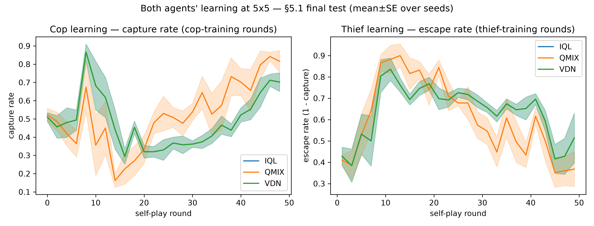
*F1 — §7.3a BOTH agents' learning at the 4×4 two-cop focus stage (cross-seed mean±SE; capture rate is
the reward proxy — the terminal signal dominates and shaping is train-only). The cop panel STARTS high
(the cop's greedy policy starts strong against an untrained thief) and capture then falls as the self-play thief improves —
the right panel shows the thief's escape rate climbing in mirror: §7.2's non-stationarity made visible.
QMIX's wider band is the monotonic-mixer training instability (R1). Train reads global `s`, exec local `o_i`.*

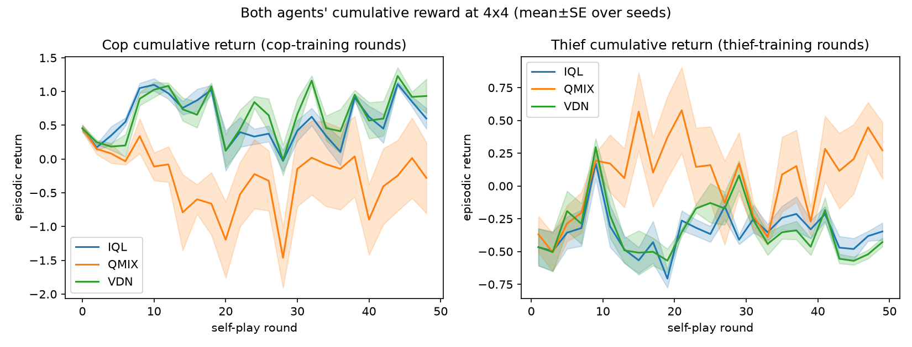
*F1b — **§7.3(a) literal**: BOTH agents' **cumulative episodic return** (the measured reward
sum per episode, mean±SE over 5 seeds) vs self-play round at 4×4. This is the reward-convergence
plot the brief names; F1 above is the same story in capture/escape rate. Note the coupling: the
IQL/VDN cop return climbs toward ≈+1.0 while its thief counterpart is pushed negative, whereas the
QMIX cop return sits **below zero** — the same monotonic-mixer instability §6 reports, now visible
in reward units. Source: `results/runs/returns_history.jsonl` (the return fields post-date the
headline 45-run matrix, so they are logged separately at the 4×4 focus stage).*

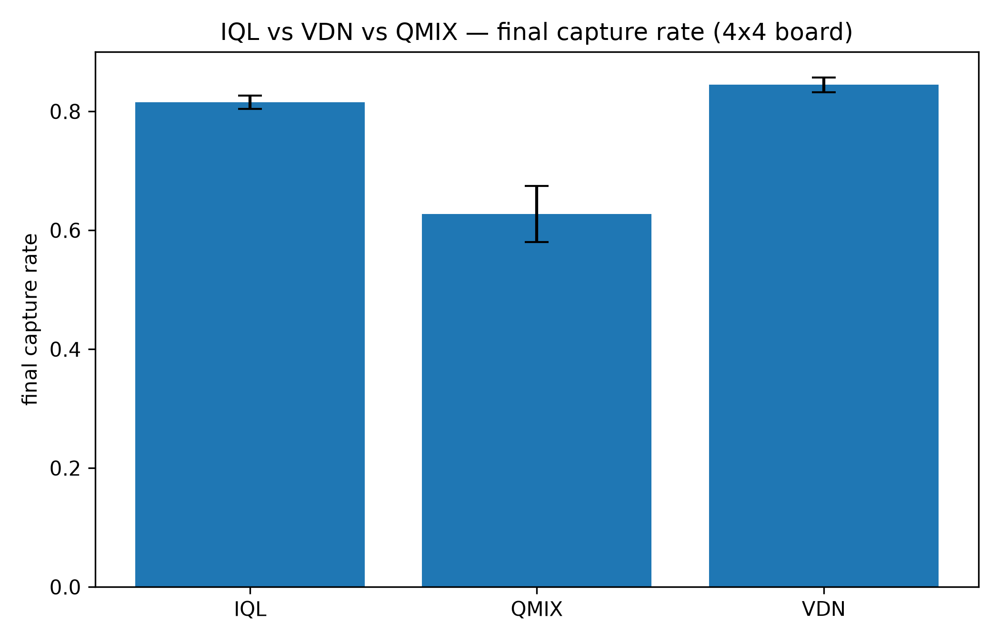
*F5 — final capture rate IQL vs VDN vs QMIX at 4×4 (SE whiskers; "final" = mean over each seed's
LAST 5 rounds, `aggregate.final_by_algorithm`, which is why it differs from the F1 endpoint): VDN most consistent (0.84), IQL a
strong baseline (0.82); the more expressive QMIX is the least stable at this 50-round budget (0.63±0.05).*

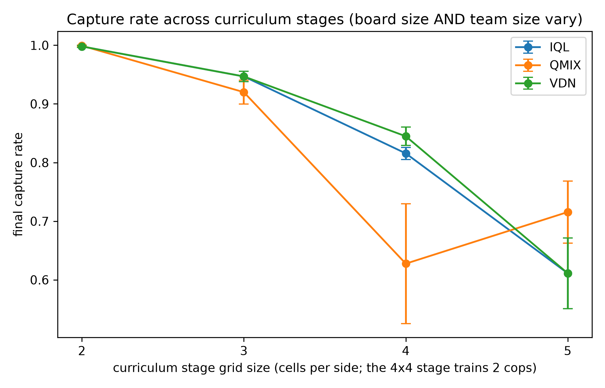
*F6 — capture rate vs grid size: capture falls as the board grows + view radius tightens (partial observability bites).*

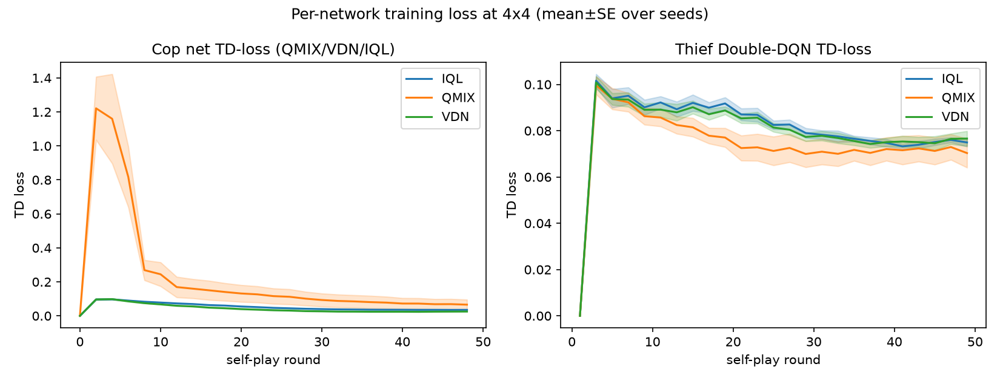
*F2 — §7.3b the two NETWORKS' TD-losses at 4×4 (mean±SE): left the cop net (QMIX/VDN/IQL), right the
thief Double-DQN. Self-play alternates which net trains each round, so pooling them into one curve
would interleave two different losses; split per network, the cop's QMIX loss visibly decays.*

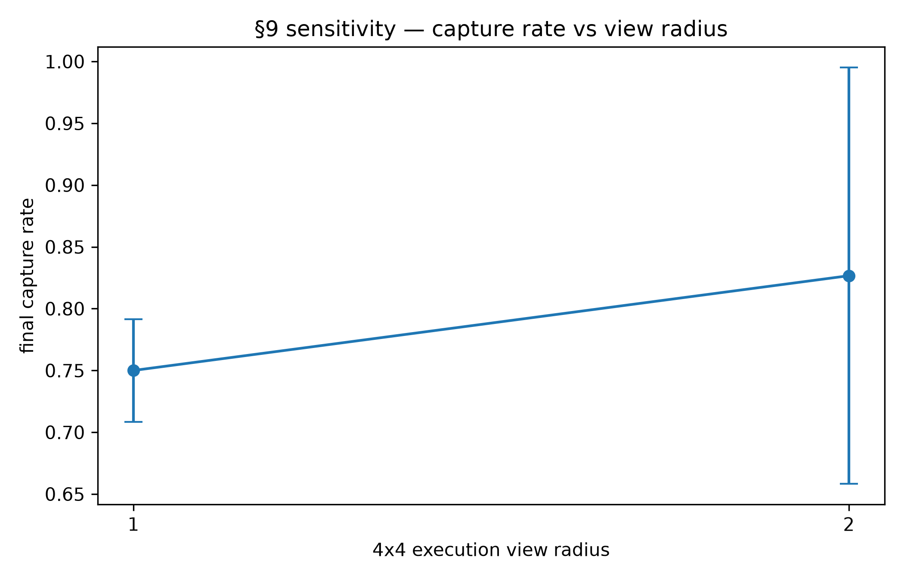
*V3-§9 sensitivity — final capture vs the 4×4 execution view radius (1 vs 2) with everything else
pinned: more observability did **not** clearly help at this budget (means close, ~4× the SE) —
see [`docs/ANALYSIS.md`](docs/ANALYSIS.md) §9.*

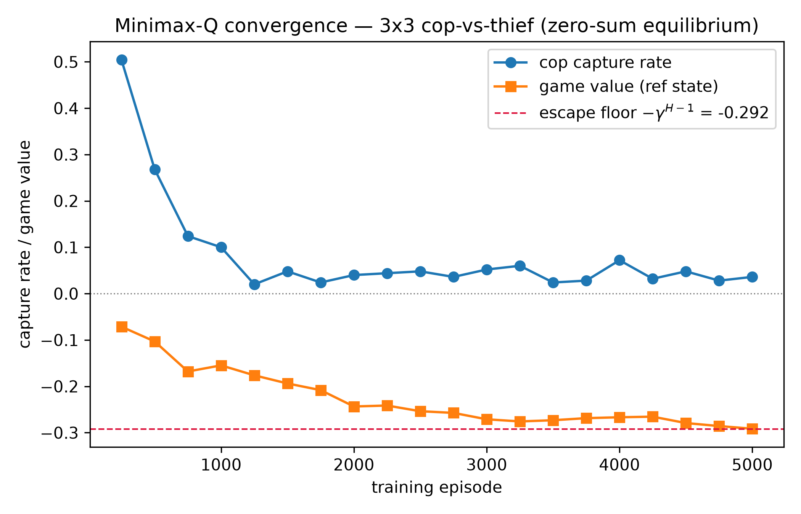
*F7 (L11 §5 bonus) — tabular Minimax-Q on the 3×3 zero-sum pursuit: the certified game value
converges DOWN onto the closed-form −γ^(H−1) = −0.292 escape floor while capture falls to ~0.04 — a
lone minimax cop cannot corner an equal-speed evader, which is exactly why capture needs the
cooperative team ([`docs/ANALYSIS.md`](docs/ANALYSIS.md) §10).*

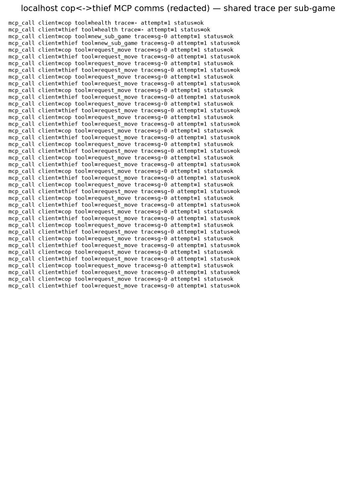
*F4 — localhost cop↔thief MCP comms (redacted): the SAME `trace` (session_id) on BOTH servers'
`request_move` calls per sub-game.*

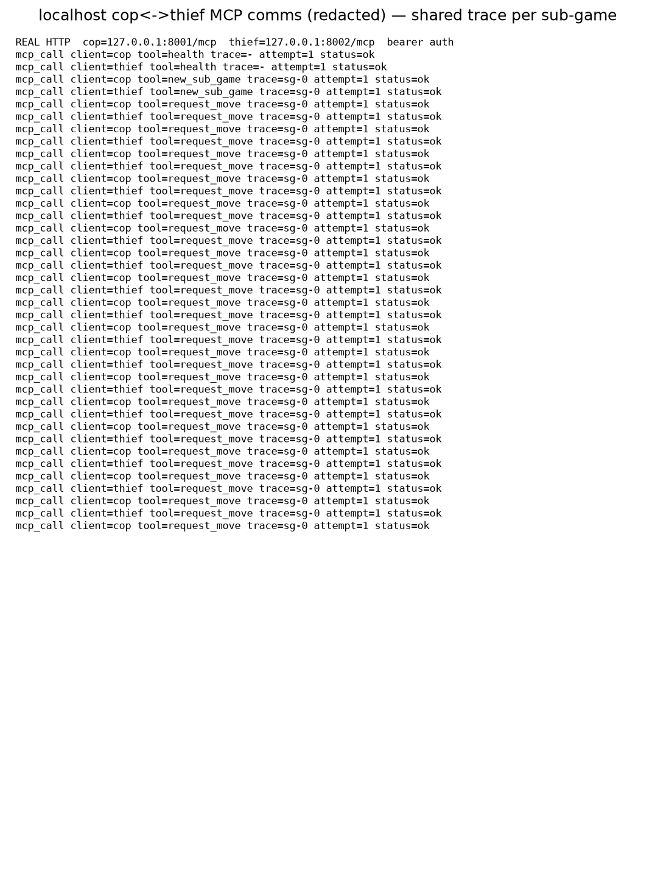
*F4b — the SAME tool contract over REAL localhost HTTP (§5.3 Stage-1): two separate server processes
on ports 8001/8002 with bearer auth, one shared `session_id` across both servers' calls
(`scripts/serve_match_http.py`).*

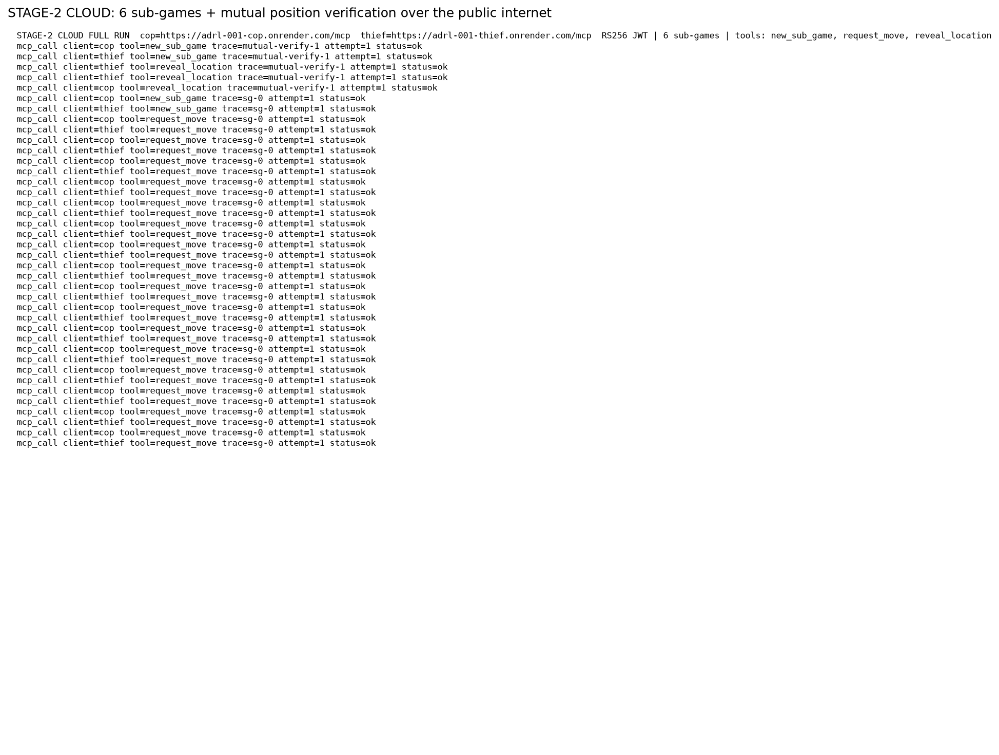
*F4c — **§5.3 Stage-2 LIVE**: a **FULL 6-sub-game match** played between two servers deployed on
Render (Oregon), driven by the referee over the **public internet** (traces `sg-0`…`sg-5`, final
cop 30 – thief 60). The capture also shows the §5.3 **mutual position verification**: each server's
`reveal_location` answers the *other* agent's HTTP query, radius-gated — an adjacent requester gets
`{visible: true, position: [1,0]}`, a distant one gets `{visible: false}`. The match's §3.5 report
body is committed at
[`results/subgames/cloud_match_5x5.redacted.json`](results/subgames/cloud_match_5x5.redacted.json)
(schema-valid, 6 sub-games, PII-redacted). URLs: `adrl-001-cop.onrender.com/mcp` ·
`adrl-001-thief.onrender.com/mcp` (RS256 JWT required).*

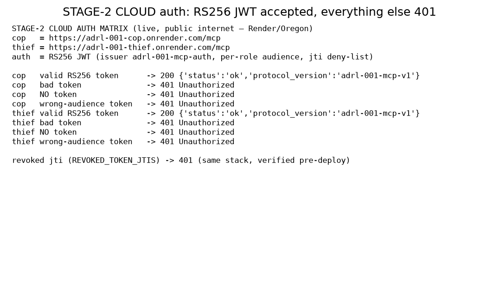
*Cloud auth (§5.3 "token-based auth that can be blocked/revoked") verified live against both public
endpoints: a valid RS256 token → 200; a bad token, a missing token, and a **wrong-audience** token
(a cop token replayed at the thief) → 401. Revocation via the `jti` deny-list (`REVOKED_TOKEN_JTIS`)
→ 401 on the identical stack. Auth is enforced in OUR app — the endpoints are publicly reachable,
as §5.3 requires.*

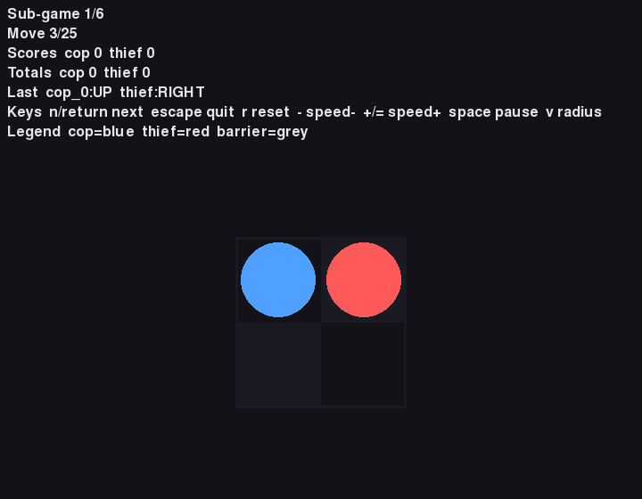 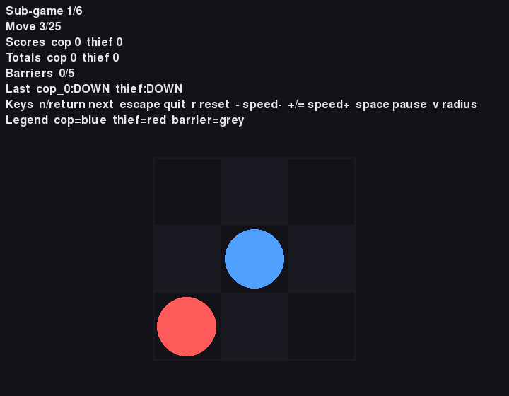 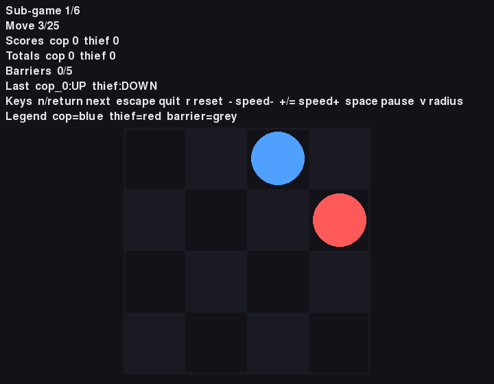 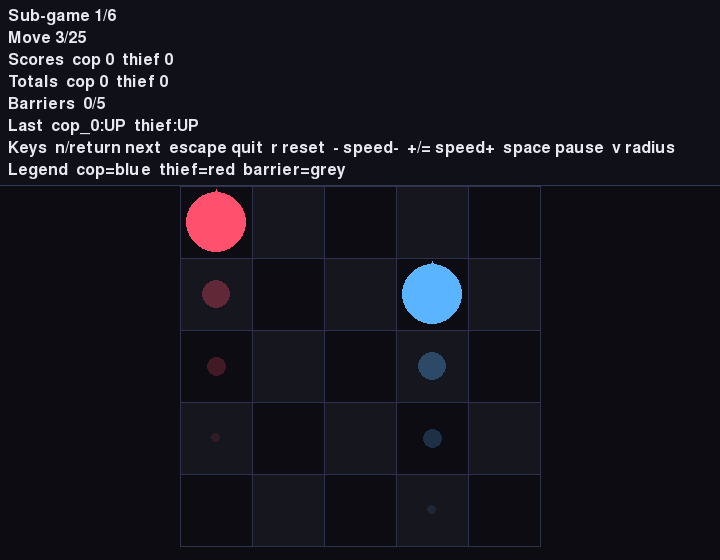
*F3 — Pygame god-view spectator at 2×2 / 3×3 / 4×4 / 5×5 (the mandatory §7.3c GUI screenshots at different grid sizes).*

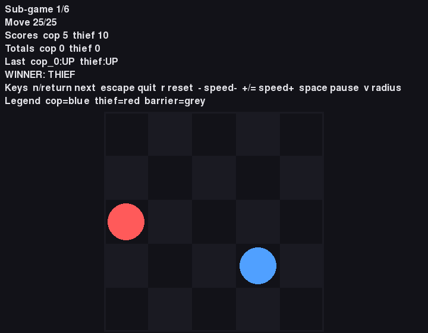 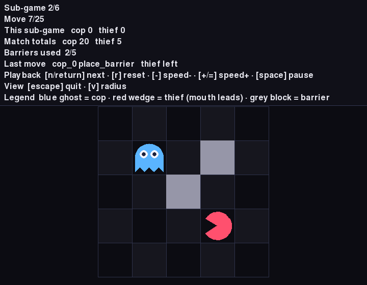
*GUI states beyond "running": the terminal winner-banner (left — move 25/25 timeout, thief wins 10/5)
and barrier rendering (right — a hand-set demo state; §5.4's barrier display. The heuristic agents only
navigate around barriers, so barriers are shown via the real draw path on a set board). The view-radius
overlay state (`state_view_radius.png`) is referenced from [`docs/UX.md`](docs/UX.md).*

End-to-end evidence: [`results/subgames/full_match_5x5.redacted.json`](results/subgames/full_match_5x5.redacted.json)
is a full 6-sub-game §3.5 report (role-only, PII-redacted) produced by `sdk.run_local_match` with FRESH
nets — schema/pipeline proof (trained performance lives in the 45-run matrix behind F1/F5/F6). The SDK-only analysis
notebook — LaTeX equations, the six plotted figures, citations, committed **executed** — is
[`notebooks/analysis.ipynb`](notebooks/analysis.ipynb). The figure manifest:

| Fig | Content | Generator | Path |
|---|---|---|---|
| **F1** | BOTH agents' learning at 4×4 (§7.3a): cop capture-rate panel + thief escape-rate panel, cross-seed mean±SE | `python -m src.results.make_figures` (plots `results/runs/*.jsonl`) | `results/figures/learning_curves.png` |
| **F1b** | BOTH agents' CUMULATIVE EPISODIC RETURN at 4×4 (§7.3a literal reward-convergence plot) | `python -m src.results.make_figures` (reads `returns_history.jsonl`) | `results/figures/return_curves.png` |
| **F2** | Per-NETWORK TD-loss at 4×4 (§7.3b): cop net (QMIX/VDN/IQL) panel + thief Double-DQN panel | `python -m src.results.make_figures` | `results/figures/loss_curves.png` |
| **F3** | GUI screenshots at 2×2/3×3/4×4/5×5 + the terminal / barrier / view-radius states (CAPTURED, not plotted) | `scripts/capture_screens.py` (headless) | `results/screenshots/grid_{2,3,4,5}x{n}.png`, `state_{terminal,barriers,view_radius}.png` |
| **F4** | MCP-comms proof — localhost in-memory contract (CAPTURED, CI-deterministic) | redacted cop↔thief comms log / `scripts/capture_comms.py` | `results/figures/mcp_comms_local.png` |
| **F4b** | MCP-comms proof over REAL localhost HTTP — ports 8001/8002, bearer auth, shared `session_id` (§5.3 Stage-1) | `scripts/serve_match_http.py` | `results/figures/mcp_comms_http.png` |
| **F4c** | **Stage-2 LIVE cloud** — full 6-sub-game match + mutual `reveal_location` verification over the public internet, RS256 JWT | referee vs the two live cloud URLs | `results/figures/mcp_comms_cloud.png` |
| **Auth** | Live cloud auth matrix — 200 valid / 401 bad / 401 none / 401 wrong-audience / 401 revoked | live verification vs both endpoints | `results/figures/cloud_auth.png` |
| **F5** | IQL vs VDN vs QMIX final capture rate at 4×4, the 2-cop stage (bar + SE whiskers) | `python -m src.results.make_figures` | `results/figures/baseline_comparison.png` |
| **F6** | Scale effect — capture-rate vs grid size | `python -m src.results.make_figures` | `results/figures/scaling.png` |
| **Sens.** | V3-§9 sensitivity — final capture vs the 4×4 view radius, all else pinned | `scripts/sensitivity_sweep.py` | `results/figures/sensitivity_view_radius.png` |
| **F7** | Minimax-Q equilibrium baseline (L11 §5 bonus): game-value + capture-rate convergence on the 3×3 zero-sum pursuit | `scripts/plot_minimax_q.py` (slow; per-step maximin LP) | `results/figures/minimax_q.png` |

F1/F2/F5/F6 regenerate from one command (`uv run python -m src.results.make_figures`); F3/F4 are
deterministically captured by their seeded scripts; **F7** (the bonus equilibrium baseline) is
regenerated on demand by `uv run python scripts/plot_minimax_q.py` (kept separate — its per-step LP
solves are slow, like the IQL/sensitivity baselines — see ANALYSIS §10). **§5.3 Stage-1 over REAL
HTTP:** `scripts/serve_match_http.py` boots BOTH servers as separate OS processes on
`mcp.cop_port`/`thief_port` (8001/8002) over Streamable HTTP + bearer auth and plays a sub-game over
the wire (the SAME `session_id` on both servers), via the same `fastmcp run … --transport http`
command `deploy/render.yaml` uses for cloud Stage-2; the F4 *figure* is captured in-memory for CI
determinism, but the identical tool contract runs over real HTTP here. (The OLoRA-vs-full-fine-tune ablation chart +
trainable-param table were **descoped** — see §6; the ~8× trainable-param reduction is asserted by
`tests/unit/test_olora_linear.py`.)

---

## 8. Risk register (summary)

The full P×I register with mitigation + fallback per owner-phase is in
[`docs/PLAN.md` §10](docs/PLAN.md) (R1–R16). The highest-impact risks and how A6 contains them:

| ID | Risk | P×I | Mitigation → Fallback |
|---|---|---|---|
| R1 | MARL non-convergence on tiny grids (the studied effect) | H×H | 2×2-first curriculum, 5 seeds, shaping, VDN arm → heuristic-thief warm start; report instability honestly |
| R2 | Cloud deploy / Prefect quota fails | M×H | localhost F4 is canonical (cloud is upside, ADR-0012) → submit local proof + smoke |
| R3 | Gmail single mandatory send fails | M×H | `smtp_smoke.py` pre-flight + idempotent sentinel + OAuth drop-in → never block on send |
| R5 | PII leak into the tracked repo | M×H | git-ignored cover sheet + CI deny-list grep + placeholders → never assert the PII artifact in a test |
| R6 | Google Drive deletes `.git` mid-session | M×H | push often + a `/tmp` clone → restore `.git` |
| R7 | A `.py` exceeds the 150-LOC cap | H×M | split early; size gate runs AFTER `ruff format` → extract submodules |
| R8 | Figures drift from code | M×M | one `make_figures` entry + a manifest config-hash → CI regenerates |
| R14 | FastMCP auth API churn (v2→v3) | M×M | verify the import path + pin the version BEFORE auth code → pin closest-to-brief |

The full sixteen entries (incl. formalism-mismatch R4, IGM-critique depth R9, OLoRA ambiguity R12,
late-penalty R15, solo-overload R16) are tabulated in `docs/PLAN.md §10`.

---

## 9. Inter-group bonus match (ex06 §9 — counts toward the FINAL PROJECT)

**Status: PREPARED — a partner group is confirmed; the match has not been played yet.**
Our §9 stack is built and tested: the `bonus_game` report serializer + §9.2 claim
derivation ([`src/reporting/bonus.py`](src/reporting/bonus.py)), the PDF-exact subject +
dual-block redaction + one-valid-email idempotent send
([`src/reporting/bonus_send.py`](src/reporting/bonus_send.py)),
[`docs/schema/bonus.schema.json`](docs/schema/bonus.schema.json), the partner-identity template
(`players.partner.example.yaml` → git-ignored `players.partner.local.yaml`; the loader is
part of the remaining match-day work), and the pre-game rules agreement + neutral
wire protocol ([`docs/interfaces/intergroup_mcp.md`](docs/interfaces/intergroup_mcp.md)).
Per §9.3, this section will record — once the match is played and both groups agree —
the opponent group's name, the final `totals_by_group`, our `bonus_claim`, and
screenshots of the bonus match.

**Match lineup (selected by a 10-seed 5×5 self-play tournament,
[`results/bonus/selection_report.json`](results/bonus/selection_report.json)):** cop =
the seed-7 QMIX net ([`deploy/model/bonus_cop.pt`](deploy/model/bonus_cop.pt), 59/60
captures vs a partial-obs fleeing evader, healthy barrier use); thief = the local-obs
greedy-flee policy (0/180 captures conceded to any barrier-less chaser in our evals),
with the seed-23 net ([`deploy/model/bonus_thief.pt`](deploy/model/bonus_thief.pt)) as
the contingency against a barrier-placing opponent cop. Selection matters: ~1 in 6
training seeds converges to a degenerate barrier-spammer (0% capture) — cross-eval
selection is what turns the trained cop into the match asset.
